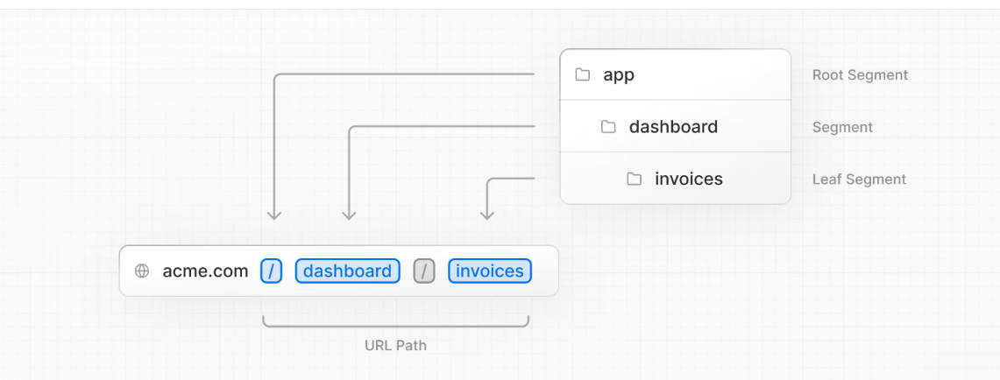
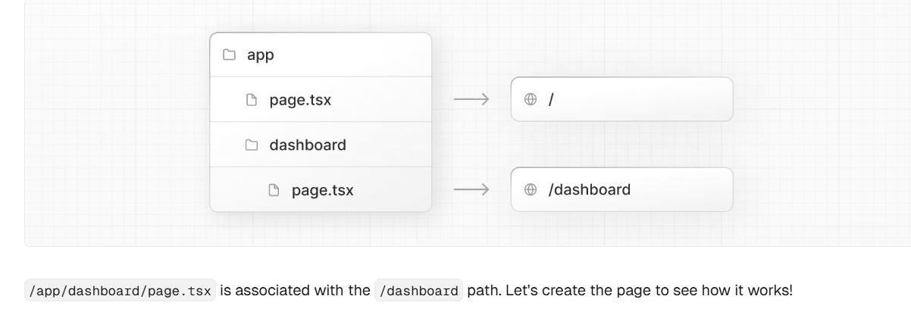
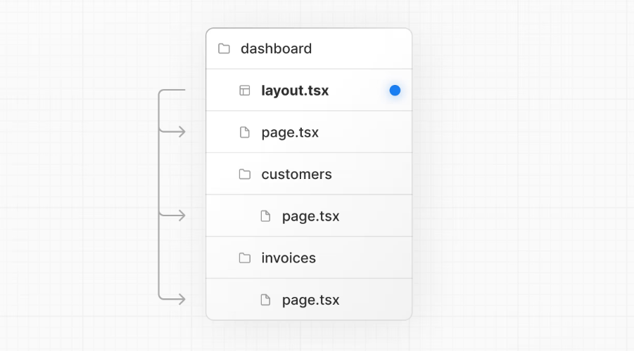
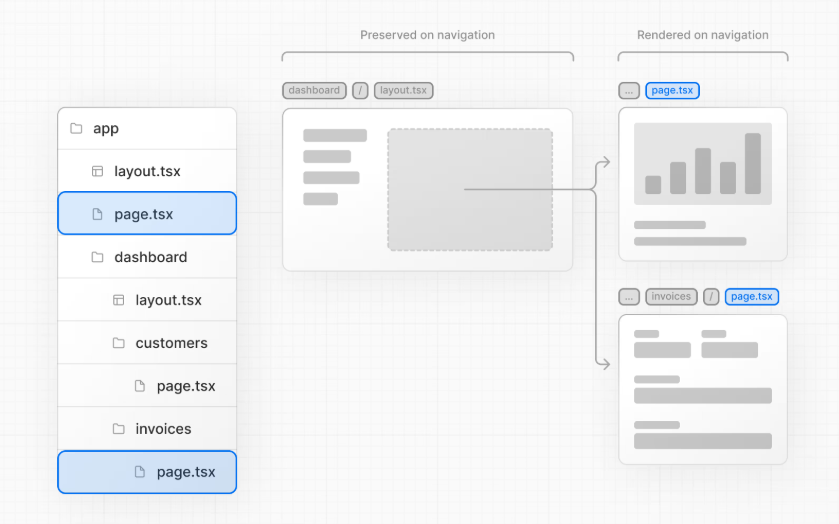
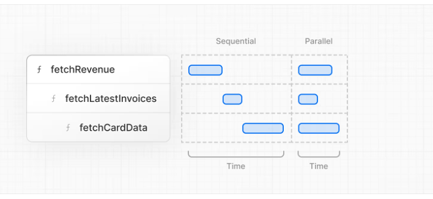
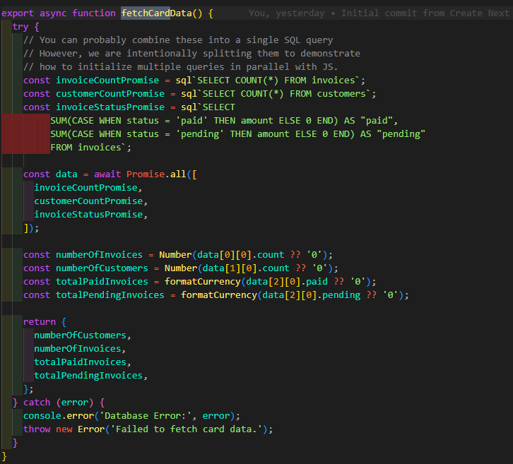
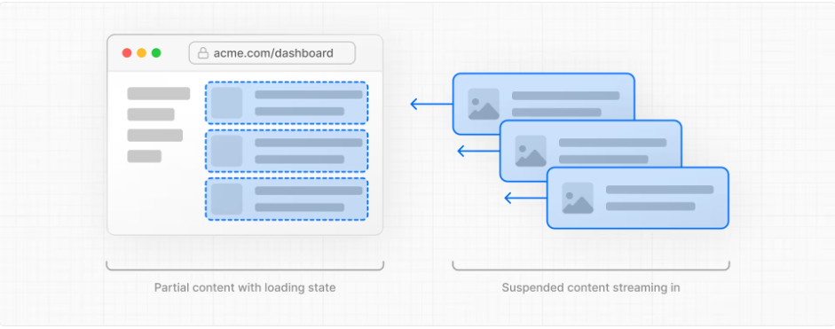
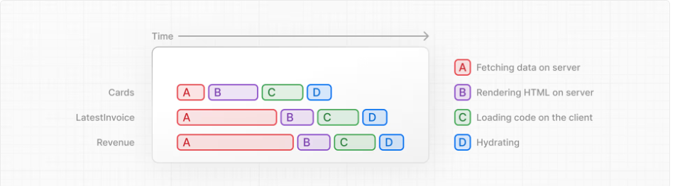
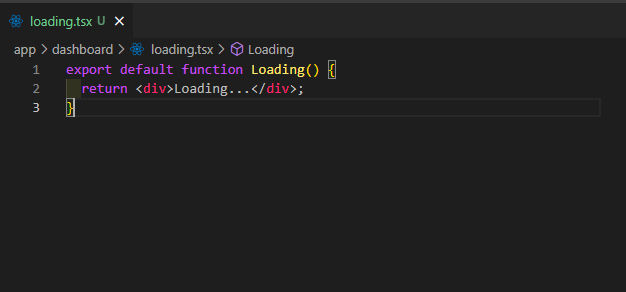
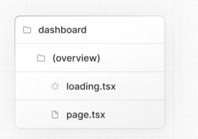

- [Next.js App Router Course - Starter](#nextjs-app-router-course---starter)
  - [Folder Structure](#folder-structure)
  - [CSS Styling](#css-styling)
    - [Global Styles](#global-styles)
    - [TailWind](#tailwind)
    - [CSS Modules](#css-modules)
    - [Using the clsx library to toggle class names](#using-the-clsx-library-to-toggle-class-names)
  - [Optimizing Fonts and Images](#optimizing-fonts-and-images)
    - [Why optimize fonts?](#why-optimize-fonts)
      - [Adding a primary font](#adding-a-primary-font)
    - [Why optimize images?](#why-optimize-images)
    - [The `<Image>` component](#the-image-component)
  - [Create Nested Routing](#create-nested-routing)
    - [Create Layout](#create-layout)
      - [Root Layout](#root-layout)
    - [🧱 What is a **Root Layout** in Next.js?](#-what-is-a-root-layout-in-nextjs)
  - [Navigation Between Pages](#navigation-between-pages)
    - [🔄 Why Optimize Navigation?](#-why-optimize-navigation)
      - [What’s Wrong with Full Page Reloads?](#whats-wrong-with-full-page-reloads)
      - [The Better Way: `<Link>` in Next.js](#the-better-way-link-in-nextjs)
      - [Why Is Navigation with  So Fast?](#why-is-navigation-with--so-fast)
    - [Showing Active Links `usePathname`](#showing-active-links-usepathname)
  - [Fetching Data](#fetching-data)
    - [API layer](#api-layer)
    - [Database queries](#database-queries)
      - [Using sql](#using-sql)
    - [Request Waterfall.](#request-waterfall)
      - [Parallel data fetching](#parallel-data-fetching)
      - [Static and Dynamic Rendering](#static-and-dynamic-rendering)
        - [Static Rendering (SSG || ISR)](#static-rendering-ssg--isr)
        - [Dynamic Rendering (SSR)?](#dynamic-rendering-ssr)
  - [Streaming](#streaming)
    - [Streaming a whole page with `loading.tsx`](#streaming-a-whole-page-with-loadingtsx)
      - [Adding loading skeletons](#adding-loading-skeletons)
        - [Fixing the loading skeleton bug with route groups](#fixing-the-loading-skeleton-bug-with-route-groups)
    - [Streaming a Component](#streaming-a-component)
      - [Grouping components](#grouping-components)
    - [Deciding where to place your Suspense boundaries](#deciding-where-to-place-your-suspense-boundaries)
  - [Community Standarts](#community-standarts)
  - [Need to look at](#need-to-look-at)
    - [Next.js Server vs Client Components ||  React Server Components. read it then add it to the notes above](#nextjs-server-vs-client-components---react-server-components-read-it-then-add-it-to-the-notes-above)
  - [Packages](#packages)

# Next.js App Router Course - Starter

This is the starter template for the Next.js App Router Course. It contains the starting code for the dashboard application.

For more information, see the [course curriculum](https://nextjs.org/learn) on the Next.js Website.


## Folder Structure 
**/app:** Contains all the routes, components, and logic for your application, this is where you'll be mostly working from.
**/app/lib:** Contains functions used in your application, such as reusable utility functions and data fetching functions.
**/app/ui:** Contains all the UI components for your application, such as cards, tables, and forms. To save time, we've pre-styled these components for you.
**/public:** Contains all the static assets for your application, such as images.
**Config Files:** You'll also notice config files such as next.config.ts at the root of your application. 


## CSS Styling

### Global Styles 
If you look inside the `/app/ui` folder, you'll see a file called `global.css`. You can use this file to add CSS rules to all the routes in your application - such as CSS reset rules, site-wide styles for HTML elements like links, and more.

You can import global.css in any component in your application, but it's usually good practice to add it to your top-level component. In Next.js, this is the `root layout` (more on this later).

### TailWind
Tailwind is a CSS framework that speeds up the development process by allowing you to quickly write utility classes directly in your React code.

In Tailwind, you style elements by adding class names. For example, adding "text-blue-500" will turn the <h1> text blue:


```jsx
```<h1 className="text-blue-500">I'm blue!</h1>```
```
Although the CSS styles are shared globally, each class is singularly applied to each element. This means if you add or delete an element, you don't have to worry about maintaining separate stylesheets, style collisions, or the size of your CSS bundle growing as your application scales.


### CSS Modules

CSS Modules allow you to **scope CSS to a component** by automatically creating unique class names, so you don't have to worry about style collisions as well.

> you should create a file with name `componentName.module.css`

### Using the clsx library to toggle class names


`clsx` is a tiny utility for **conditionally combining class names** — cleanly handles strings, arrays, objects, and falsy values.


Common Use Cases:

1. **Conditional Classes**

```tsx
clsx("btn", isActive && "active")
```

2. **Multiple Conditions with Object**

```tsx
clsx("card", {
  "bg-blue": theme === "blue",
  "bg-red": theme === "red",
})
```

3. **Combining Props with Local Styles**

```tsx
clsx("base-styles", className)
```
So its great for **reusable components** (avoids `undefined` in final class string)

```tsx
clsx("btn", undefined, false) // → "btn"
```

## Optimizing Fonts and Images

### Why optimize fonts?
Fonts play a significant role in the design of a website, but using custom fonts in your project can affect performance if the font files need to be fetched and loaded.

Cumulative Layout Shift is a metric used by Google to evaluate the performance and user experience of a website. With fonts, layout shift happens when the browser initially renders text in a fallback or system font and then swaps it out for a custom font once it has loaded. This swap can cause the text size, spacing, or layout to change, shifting elements around it.

Next.js automatically optimizes fonts in the application when you use the `next/font` module. It downloads font files at build time and hosts them with your other static assets. This means when a user visits your application, there are no additional network requests for fonts which would impact performance.

#### Adding a primary font
In your `/app/ui` folder, create a new file called fonts.ts. You'll use this file to keep the fonts that will be used throughout your application.

[Adding multiple Fonts ](https://nextjs.org/docs/app/getting-started/fonts#using-multiple-fonts) [ ] 

[Full list of options](https://nextjs.org/docs/app/api-reference/components/font#font-function-arguments) [ ]


### Why optimize images?
Next.js can serve static assets, like images, under the top-level `/public` folder. Files inside `/public` can be referenced in your application.

With regular HTML, you would add an image as follows:

```html


```


**However, this means you have to manually:**
   - Ensure your image is responsive on different screen sizes.
   - Specify image sizes for different devices.
   - Prevent layout shift as the images load.
   - Lazy load images that are outside the user's viewport.

Image Optimization is a large topic in web development that could be considered a specialization in itself. Instead of manually implementing these optimizations, you can use the `next/image` component to automatically optimize your images.

### The `<Image>` component
The `<Image>` Component is an extension of the HTML `` tag, and comes with automatic image optimization, such as:

- Preventing layout shift automatically when images are loading.
- Resizing images to avoid shipping large images to devices with a smaller viewport.
- Lazy loading images by default (images load as they enter the viewport).
- Serving images in modern formats, like WebP and AVIF, when the browser supports it.


> It's good practice to set the width and height of your images to avoid layout shift, these should be an aspect ratio identical to the source image. 
> 
> Note: The width and height here don’t control the rendered size directly but tell the browser the intrinsic aspect ratio of the image to reserve the correct space before it loads.


>  Images without dimensions and web fonts are common causes of layout shift.


## Create Nested Routing
Next.js uses file-system routing where **folders are used to create nested routes**. Each folder represents a route segment that maps to a URL segment.

You can create separate UIs for each route using `layout.tsx` and `page.tsx` files.


`page.tsx` **is a special Next.js file** that exports a React component, **and it's required for the route to be accessible**. In your application, you already have a page file: `/app/page.tsx `- this is the home page associated with the route `/`.


> To create a nested route, you can nest folders inside each other and add page.tsx files inside them. For example:




[ ]  [Colocation and private folders](https://nextjs.org/docs/app/getting-started/project-structure#colocation) 


### Create Layout 
`layout.tsx` in Next.js
- It's a special file that lets you create a shared UI wrapper around multiple pages. For example, a dashboard might have a sidebar that shows on every page inside `/dashboard`. So instead of adding the sidebar to every page manually, you create one `layout.tsx` inside `/dashboard `that wraps all its pages.




> One benefit of using layouts in Next.js is that on navigation, only the page components update while the layout won't re-render. This is called partial rendering which preserves client-side React state in the layout when transitioning between pages.



[ ] [Partial Rendering 🔥](https://nextjs.org/docs/app/getting-started/linking-and-navigating#4-partial-rendering)


#### Root Layout 


### 🧱 What is a **Root Layout** in Next.js?

* It’s a special file: **`/app/layout.tsx`**
* Required in every Next.js app (using the App Router)
* It wraps **all pages** in your app so Any UI you add to the root layout will be shared across all pages in your application
  
* You use it to define:

  * your <html> and <body> tags, and add metadata
  * Global styles
  * Things like headers or footers shared across the whole site


| Layout Type       | File                        | Applies To                     |
| ----------------- | --------------------------- | ------------------------------ |
| **Root Layout**   | `/app/layout.tsx`           | The **whole app**              |
| **Nested Layout** | `/app/dashboard/layout.tsx` | Only `/dashboard` and subpages |


## Navigation Between Pages 


### 🔄 Why Optimize Navigation?

In traditional websites, you navigate between pages using the regular `<a>` HTML element. But when we use `<a>` HTML element each time you click a link, the entire page **refreshes**. This is called a **full page reload** — and it’s something we want to avoid in modern web apps.

#### What’s Wrong with Full Page Reloads?

When the browser does a full page reload:

* It **re-downloads** the entire HTML, CSS, and JavaScript
* It **re-initializes React**
* It **clears any app state** (like form inputs or scroll position)
* It **feels slow and less smooth**

which  leads to a poor user experience.


####  The Better Way: [`<Link>`](https://nextjs.org/docs/app/api-reference/components/link) in Next.js

Next.js provides a special `<Link>` component that enables **fast, client-side navigation** — without a full reload.

Here’s how you use it:

```tsx
import Link from 'next/link';

<Link href="/invoices">Invoices</Link>
```

With this, only the necessary content updates, and your app feels smooth and responsive — like a true single-page application (SPA).


| <!--             | Traditional `<a>`       | Next.js `<Link>` |
| ---------------- | ----------------------- |
| Full page reload | No reload, fast updates |
| Loses state      | Keeps state             |
| Feels slow       | Feels like an app       |

--- -->

#### Why Is Navigation with <Link> So Fast?
Next.js automatically improves your app with:

1. Automatic Code-Splitting
Your app is split into smaller bundles — one for each page.

This means users only download the code they need for the current page.

Other pages are loaded on demand, not all at once.

If a page crashes, the rest of the app keeps working.

➡️ Result: Faster load times and better performance.

2. Automatic Prefetching
In production, when a <Link> appears on screen (in the viewport), Next.js automatically prefetches the linked page in the background.

So when the user clicks it, the page is already loaded — making transitions feel instant.

➡️ Result: Super smooth, app-like navigation.

### Showing Active Links `usePathname`
A common UI pattern is to show an active link to indicate to the user what page they are currently on. To do this, you need to get the user's current path from the URL. Next.js provides a hook called `usePathname` that you can use to check the path and implement this pattern.


> ‼️This React hook only works in a client component so you'll need to turn the component that use to client component by adding `use client`  directive to the top of the file


## Fetching Data 
<!-- 
Learn about some approaches to fetching data: APIs, ORMs, SQL, etc.

How Server Components can help you access back-end resources more securely.

What network waterfalls are.

How to implement parallel data fetching using a JavaScript Pattern. 
-->


### API layer
APIs are an intermediary layer between your application code and database. There are a few cases where you might use an API:
- If you're using third-party services that provide an API.
- If you're fetching data from the client, you want to have an API layer that runs on the server to avoid exposing your database secrets to the client.


you can create API endpoints using
[ ] [Route Handlers](https://nextjs.org/docs/app/api-reference/file-conventions/route) 

### Database queries
When you're creating a full-stack application, you'll also need to write logic to interact with your database. For relational databases like Postgres, you can do this with SQL or with an ORM.

There are a few cases where you have to write database queries:

- When creating your API endpoints, you need to write logic to interact with your database.
- If you are using React Server Components (fetching data on the server), you can skip the API layer, and query your database directly without risking exposing your database secrets to the client.
 
 <!-- If YOU are writing the backend (like using Prisma, PostgreSQL, etc.):
You can skip creating an API and directly talk to your DB inside a Server Component.

This is possible only on the server, so no secrets (like DB credentials) are exposed to the clien -->
#### Using sql 
There are a few reasons why we'll be using SQL:

- SQL is the industry standard for querying relational databases (e.g. ORMs generate SQL under the hood).
- Having a basic understanding of SQL can help you understand the fundamentals of relational databases, allowing you to apply your knowledge to other tools.
- SQL is versatile, allowing you to fetch and manipulate specific data.
- The postgres.js library provides protection against SQL injections.


> ⚠️However... while fetching data there are two things you need to be aware of:
  - The data requests are unintentionally blocking each other, creating a request waterfall.
  - By default, Next.js **prerenders routes to improve performance, this is called Static Rendering**.**So if your data changes, it won't be reflected in your dashboard**.
### Request Waterfall.
A "waterfall" refers to a sequence of network requests that depend on the completion of previous requests. In the case of data fetching, each request can only begin once the previous request has returned data.

This pattern is not necessarily bad. There may be cases where you want waterfalls because you want a condition to be satisfied before you make the next request. For example, you might want to fetch a user's ID and profile information first. Once you have the ID, you might then proceed to fetch their list of friends. In this case, each request is contingent on the data returned from the previous request.


⚠️ this behavior can also be unintentional and impact performance.

#### Parallel data fetching 
A common way to avoid waterfalls is to initiate all data requests at the same time - in parallel.

In JavaScript, you can use the `Promise.all()` or `Promise.allSettled()` functions to initiate all promises at the same time


**By using this pattern, you can:**

- Start executing all data fetches at the same time, which is faster than waiting for each request to complete in a waterfall.
- Use a native JavaScript pattern that can be applied to any library or framework.
**However, there is one disadvantage of relying only on this JavaScript pattern: what happens if one data request is slower than all the others???**


#### Static and Dynamic Rendering                              
In the previous chapter, you fetched data for the Dashboard Overview page. However, we briefly discussed two limitations of the current setup:

- The data requests are creating an unintentional waterfall.
- The dashboard is static, so any data updates will not be reflected on your application.

##### Static Rendering (SSG || ISR)

With static rendering, data fetching and rendering happens on the server at build time (when you deploy) or when [revalidating data](https://nextjs.org/docs/app/getting-started/fetching-data#revalidating-data).

Whenever a user visits your application, the cached result is served. There are a couple of benefits of **static rendering**:

- Faster Websites - Prerendered content can be cached and globally distributed when deployed to platforms like Vercel. This ensures that users around the world can access your website's content more quickly and reliably.
- 
- Reduced Server Load - Because the content is cached, your server does not have to dynamically generate content for each user request. This can reduce compute costs.
- 
- SEO - Prerendered content is easier for search engine crawlers to index, as the content is already available when the page loads. This can lead to improved search engine rankings.
  
Static rendering is useful for UI with *no data* or *data that is shared across users*, such as a static blog post or a product page. It might not be a good fit for a dashboard that has personalized data which is regularly updated.

##### Dynamic Rendering (SSR)?
With dynamic rendering, *content is rendered on the server* **for each user at request time** (when the user visits the page). There are a couple of benefits of dynamic rendering:

- Real-Time Data - Dynamic rendering allows your application to display real-time or frequently updated data. This is ideal for applications where data changes often.
  
- User-Specific Content - It's easier to serve personalized content, such as dashboards or user profiles, and update the data based on user interaction.
  
- Request Time Information - Dynamic rendering allows you to access information that can only be known at request time, such as cookies or the URL search parameters.


> With dynamic rendering, **your application is only as fast as your slowest data fetch**

> The Slow data fetch will make your first loading very slowbecause its blocking you whole page  which will  cause a terrible UX so look at Streaming


## Streaming 
Streaming is a data transfer technique that allows you to break down a route into smaller "chunks" and progressively stream them from the server to the client as they become ready.



**By streaming, you can prevent slow data requests from blocking your whole page. This allows the user to see and interact with parts of the page without waiting for all the data to load before any UI can be shown to the user.**



### Streaming a whole page with `loading.tsx`
Streaming works well with React's component model, as each component can be considered a chunk.

There are two ways you implement streaming in Next.js:

1. At the page level, with the `loading.tsx` file (which creates `<Suspense>` for you).
   
2. At the component level, with `<Suspense>` for more granular control.


A few things are happening here:

- `loading.tsx` is a special Next.js file built on top of React Suspense. It allows you to create fallback UI to show as a replacement while page content loads.
  
- Since <SideNav> is static, it's shown immediately. The user can interact with <SideNav> while the dynamic content is loading.
  
- The user doesn't have to wait for the page to finish loading before navigating away (this is called **interruptable navigation**).


#### Adding loading skeletons
<!-- chapter 9 -->
A loading skeleton is a simplified version of the UI. Many websites use them as a placeholder (or fallback) to indicate to users that the content is loading. Any UI you add in `loading.tsx` will be embedded as part of the static file, and sent first. Then, the rest of the dynamic content will be streamed from the server to the client.


##### Fixing the loading skeleton bug with route groups
Right now, your loading skeleton will apply to the invoices.

Since `loading.tsx` is a level higher than `/invoices/page.tsx` and `/customers/page.tsx` in the file system, it's also applied to those pages.

We can change this with Route Groups. Create a new folder called `/(overview)` inside the dashboard folder. Then, move your `loading.tsx` and `page.tsx` files inside the folder:



Now, the `loading.tsx` file will only apply to your dashboard overview page.

[Route groups](https://nextjs.org/docs/app/api-reference/file-conventions/route-groups) allow you to organize files into logical groups **without affecting the URL path** structure. When you create a new folder using **parentheses ()**, **the name won't be included in the URL path**. So `/dashboard/(overview)/page.tsx` becomes `/dashboard`.

Here, you're using a route group to ensure loading.tsx only applies to your dashboard overview page. However, you can also use route groups to separate your application into sections (e.g. (marketing) routes and (shop) routes) or by teams for larger applications.


### Streaming a Component
So far, you're streaming a whole page. But you can also be more granular and stream specific components using React Suspense.

Suspense allows you to defer rendering parts of your application until some condition is met (e.g. data is loaded). You can wrap your dynamic components in Suspense. Then, pass it a fallback component to show while the dynamic component loads

**To do so, you'll need to move the data fetch to the component**, 

#### Grouping components
 now you need to wrap the <Card> components in Suspense. You can fetch data for each individual card, but this could lead to a popping effect as the cards load in, this can be visually jarring for the user.

So, how would you tackle this problem?

To create more of a staggered effect, `you can group the cards using a wrapper component`. This means the static <SideNav/> will be shown first, followed by the cards, etc.


>  You can use this pattern when you want multiple components to load in at the same time.


### Deciding where to place your Suspense boundaries


Where you place your Suspense boundaries will depend on a few things:

- How you want the user to experience the page as it streams.
- What content you want to prioritize.
- If the components rely on data fetching.
  
Take a look at your dashboard page, is there anything you would've done differently?

Don't worry. There isn't a right answer.

- You could stream the whole page like we did with loading.tsx... but that may lead to a longer loading time if one of the components has a slow data fetch.
  
- You could stream every component individually... but that may lead to UI popping into the screen as it becomes ready.
  
- You could also create a staggered effect by streaming page sections. But you'll need to create wrapper components.
Where you place your suspense boundaries will vary depending on your application. In general, **it's good practice to move your data fetches down to the components that need it** , and **then wrap those components in Suspense. But there is nothing wrong with streaming the sections or the whole page if that's what your application needs**.


## Community Standarts 

**Next.js Naming Conventions (with TypeScript)**

 **Use PascalCase (UpperCase)** for:

* ✅ React components → `UserCard.tsx`
* ✅ TypeScript types/interfaces → `User.ts`, `UserTypes.ts`
* ✅ Component folders (optional) → `/components/UserCard/`


 **Use lowercase** for:

* ✅ Pages and routes → `about.tsx`, `dashboard/page.tsx`
* ✅ API routes → `api/hello.ts`
* ✅ Public assets → `logo.png`

| Use Case           | Naming Convention                                   | Applies To           |
| ------------------ | --------------------------------------------------- | -------------------- |
| React Components   | `PascalCase`                                        | React + Next.js      |
| Hooks              | `camelCase`                                         | React + Next.js      |
| Utility functions  | `camelCase`                                         | React + Next.js      |
| Types/Interfaces   | `PascalCase`                                        | React + Next.js (TS) |
| Pages / Routes     | `lowercase`                                         | **Next.js only**     |
| Folders (optional) | `PascalCase` for components, `lowercase` for routes | Both                 |

*Why are pages and routes lowercase only in Next.js?*
  Because Next.js uses file-based routing — meaning: Your file/folder names define your URLs.
It creates the route:
 http://your-site.com/About ❌ (capital "A")

But in practice, URLs are expected to be:
 http://your-site.com/about ✅ (lowercase)

Why are pages and routes lowercase only in Next.js?
- Next.js uses file-based routing, so file names become URL paths.
- URLs are conventionally lowercase for consistency and SEO.
- On case-sensitive systems (like Linux), About.tsx ≠ about.tsx, which can cause bugs.
- Using lowercase avoids these issues and matches URL standards.

> In React (non-Next.js), routes are defined manually, so casing is flexible.

## Need to look at 

[ ] [How Core Web Vitals affect SEO](https://vercel.com/blog/how-core-web-vitals-affect-seo)


[ docs](https://nextjs.org/docs/app/getting-started/installation)

[ ] [Neon serverless driver](https://neon.com/docs/serverless/serverless-driver) 

<!-- What the meaning of server less  -->

###  Next.js Server vs Client Components ||  React Server Components. read it then add it to the notes above
By default, all components in Next.js are Server Components, unless you add 'use client'.

- Server Components run on the server — ideal for data fetching and performance.
- Server Components support JavaScript Promises, providing a solution for asynchronous tasks like data fetching natively. You can use async/await syntax without needing useEffect, useState or other data fetching libraries.
- Server Components run on the server, so you can keep expensive data fetches and logic on the server, only sending the result to the client.

If you're using a backend API (like Swagger) provided by your team:

You call the API, not the database directly.

You can call it in a Server Component (runs on server) or a Client Component (runs in browser).

Use 'use client' only when you need interactivity (like buttons, forms, useState, etc.).

If you're building the backend yourself, you can skip API calls and query the database directly inside Server Components.


## Packages 
https://github.com/porsager/postgres